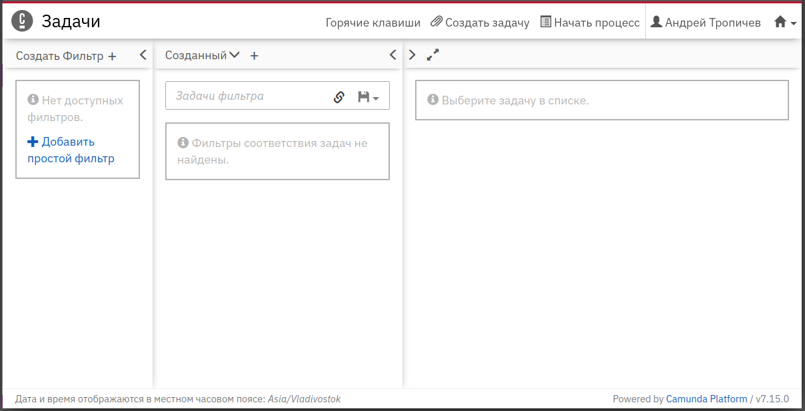

# springboot-webapp-ru-webjar
Перевод Camunda Tasklist в Spring Boot на русский язык

Идея взята [отсюда](https://github.com/camunda-consulting/code/tree/master/snippets/springboot-customized-webapps). Переделано под версию *Camunda `7.15.0`*. Оставлен только перевод на русский язык приложения Camunda Tasklist. Остальные возможности [оригинала](https://github.com/camunda-consulting/code/tree/master/snippets/springboot-customized-webapps) пока не реализованы.

## Как пользоваться?

* Скачать репозиторий и установить библиотеку
```bash
 git clone https://github.com/ATropichev/springboot-webapp-ru-webjar.git
 cd springboot-webapp-ru-webjar
 mvn clean install
```
* Сгенерировать новый проет [Camunda Platform Initializr](https://start.camunda.com/) с включенной опцией `Webapps` (или использовать существующий)
* В файл POM.XML проекта в `<properties>` добавить 
```xml
<properties>
    <camunda.spring-boot.version>7.15.0</camunda.spring-boot.version>
</properties>
```
* и изменить `<dependencies>`

```xml
<!-- Добавляем локализованные webapp -->
        <dependency>
            <groupId>io.github.atropichev</groupId>
            <artifactId>springboot-webapp-ru-webjar</artifactId>
            <version>${camunda.spring-boot.version}</version>
        </dependency>

        <dependency>
            <groupId>org.camunda.bpm.springboot</groupId>
            <artifactId>camunda-bpm-spring-boot-starter-webapp</artifactId>
            <version>${camunda.spring-boot.version}</version>
<!-- Исключаем штатные webapp -->
            <exclusions>
                <exclusion>
                    <groupId>org.camunda.bpm.webapp</groupId>
                    <artifactId>camunda-webapp-webjar</artifactId>
                </exclusion>
            </exclusions>
        </dependency>
```
* Пересобрать и запустить проект

По адресу http://localhost:8080/camunda/app/tasklist/default/ должен отобразиться Tasklist с интерфейсом на русском языке



License
-------

[Apache License, Version 2.0](http://www.apache.org/licenses/LICENSE-2.0).
